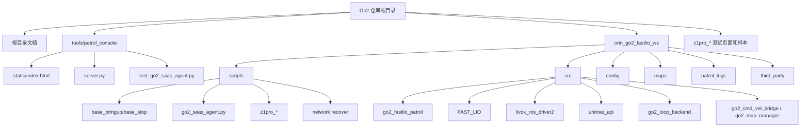
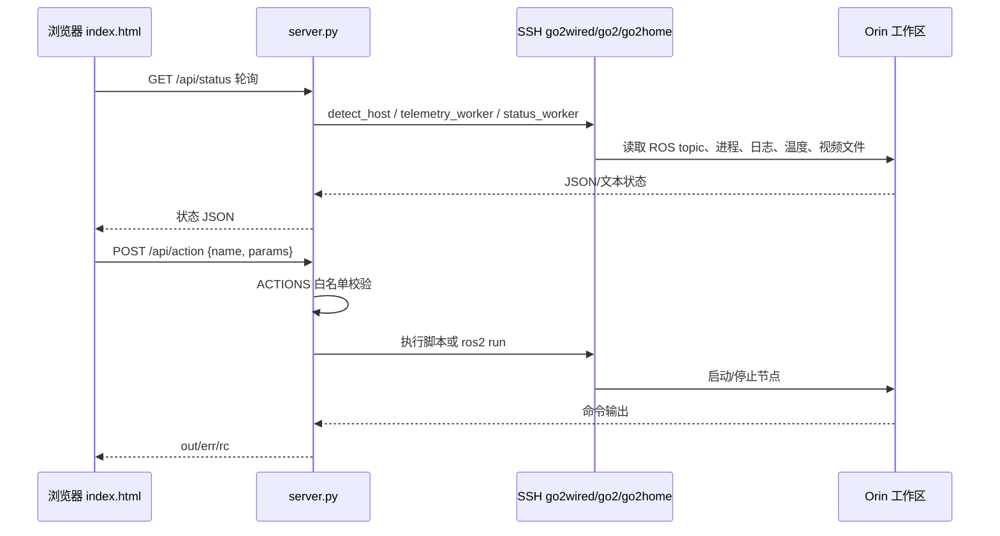
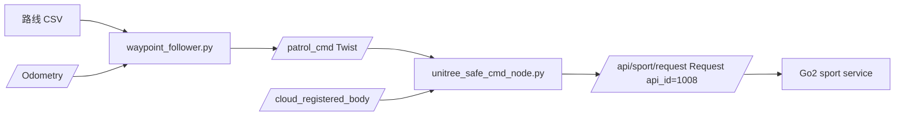

# Go2 项目目录关系与 Python 调用关系说明

更新时间: 2026-07-07

本文说明当前仓库中各文件夹之间的关系、主要 Python 文件之间的调用关系，以及哪些文件属于主链路、辅助链路、诊断/历史链路。

仓库里包含大量第三方源码、地图数据、视频/图片样本。真正参与当前巡检业务闭环的核心文件集中在三个位置：

```text
tools/patrol_console/              # Mac 本地网页管理台
orin_go2_fastlio_ws/scripts/        # Orin 上运行的脚本层
orin_go2_fastlio_ws/src/            # ROS2 包和底层驱动
```

---

## 1. 主次分级

### P0 主链路，当前系统运行必需

这些文件/目录构成“启动底座、录路线、跟路线、避障门控、上传云端、网页控制”的主流程。

```text
tools/patrol_console/server.py
tools/patrol_console/static/index.html

orin_go2_fastlio_ws/scripts/env_common.sh
orin_go2_fastlio_ws/scripts/base_bringup.sh
orin_go2_fastlio_ws/scripts/base_stop.sh
orin_go2_fastlio_ws/scripts/go2_saas_agent.py
orin_go2_fastlio_ws/scripts/z1pro_capture.sh
orin_go2_fastlio_ws/scripts/z1pro_gcu_control.py
orin_go2_fastlio_ws/scripts/z1pro_preset.sh

orin_go2_fastlio_ws/src/go2_fastlio_patrol/go2_fastlio_patrol/route_recorder.py
orin_go2_fastlio_ws/src/go2_fastlio_patrol/go2_fastlio_patrol/waypoint_follower.py
orin_go2_fastlio_ws/src/go2_fastlio_patrol/go2_fastlio_patrol/unitree_safe_cmd_node.py

orin_go2_fastlio_ws/src/livox_ros_driver2/
orin_go2_fastlio_ws/src/FAST_LIO/
orin_go2_fastlio_ws/src/unitree_api/
```

### P1 辅助主链路，常用但不一定每次启动都需要

这些文件支持 3D 点云、SaaS 测试、网络恢复、离线地图处理。

```text
tools/patrol_console/test_go2_saas_agent.py
tools/patrol_console/static/vendor/three.min.js
tools/patrol_console/static/vendor/OrbitControls.js

orin_go2_fastlio_ws/scripts/go2_network_recover.sh
orin_go2_fastlio_ws/scripts/install_network_recover.sh
orin_go2_fastlio_ws/scripts/z1pro_upload_segment.sh

orin_go2_fastlio_ws/src/go2_loop_backend/
orin_go2_fastlio_ws/config/
orin_go2_fastlio_ws/maps/
```

### P2 诊断、实验、恢复工具

这些文件用于排查、复现实验、修复坏数据，不是常规巡检必经路径。

```text
tools/rescue_basement.py

orin_go2_fastlio_ws/go2_start_level_scan.sh
orin_go2_fastlio_ws/scripts/go2_motion_probe.sh
orin_go2_fastlio_ws/scripts/run_roomtest7_readme_safe_patrol.sh
orin_go2_fastlio_ws/scripts/run_roomtest7_cli_cmd_patrol.sh
orin_go2_fastlio_ws/scripts/probe_legacy_go2_cmd_bridge.sh
orin_go2_fastlio_ws/scripts/check_legacy_send_cmd_start.sh
orin_go2_fastlio_ws/scripts/enable_oa_only.py
orin_go2_fastlio_ws/maps/loop_backend/build_optimized_map_preserve_rp.py
```

### P3 历史、旧链路、第三方/vendor、样本数据

这些内容保留作依赖或历史参考，通常不应先改。

```text
orin_go2_fastlio_ws/scripts/patrol_cli.disabled_before_cmd_rework.py
orin_go2_fastlio_ws/scripts/start_legacy_go2_cmd_bridge.sh
orin_go2_fastlio_ws/scripts/stop_legacy_go2_cmd_bridge.sh
orin_go2_fastlio_ws/scripts/build_legacy_iox_stub.sh

orin_go2_fastlio_ws/src/go2_fastlio_patrol/go2_fastlio_patrol/unitree_cmd_node.py
orin_go2_fastlio_ws/src/go2_fastlio_patrol/go2_fastlio_patrol/unitree_go_safe_cmd_node.py
orin_go2_fastlio_ws/src/go2_fastlio_patrol/go2_fastlio_patrol/waypoint_follower_old.py

orin_go2_fastlio_ws/src/Livox-SDK2/
orin_go2_fastlio_ws/third_party/
z1pro_*_test/
*.mp4 / *.jpg 样本文件
```

---

## 2. 总体目录关系



### 根目录

根目录主要放交接文档、现场手册、样本媒体和两个大工作区：

```text
README.md                         # 原始部署说明
FIELD_GUIDE.md                    # 现场操作流程
HANDOFF_FOR_NEXT_DEVELOPER.md     # 最新交接文档
MOTION_CONTROL_CHAIN_ANALYSIS.md  # 运动控制链路分析
CAMERA_Z1PRO_NOTES.md             # Z-1Pro 摄像头验证记录

tools/                            # Mac 本地工具
orin_go2_fastlio_ws/              # Orin 工作区本地同步副本
z1pro_*_test/                     # 相机/云台测试页面
```

根目录文档解释“怎么用”，`tools/` 负责本地网页控制，`orin_go2_fastlio_ws/` 负责实际机器人运行。

### `tools/`

```text
tools/
  patrol_console/                 # 当前主控制台
  rescue_basement.py              # 单次坏地图/坏路线救援工具
```

`tools/patrol_console` 是 Mac 侧入口。它不直接运行 ROS，而是通过 SSH 调用 Orin 上的脚本和 ROS2 命令。

### `tools/patrol_console/`

```text
tools/patrol_console/
  server.py                       # FastAPI 后端，动作白名单和 SSH 调度中心
  static/index.html               # 浏览器单页前端
  static/vendor/three.min.js      # 3D 点云显示
  static/vendor/OrbitControls.js  # 3D 相机控制
  test_go2_saas_agent.py          # GoGoGuard fake server 测试
  requirements.txt                # 本地 Python 依赖
  README.md                       # 管理台说明
```

关系：

```text
浏览器 index.html
  -> fetch /api/status, /api/routes, /api/action ...
  -> server.py
  -> SSH 到 Orin
  -> scripts/ 或 ros2 run 节点
```

### `orin_go2_fastlio_ws/`

这是 Orin 上 `/home/unitree/go2_fastlio_ws` 的本地同步副本。Mac 管理台和云端 agent 都围绕这个工作区运行。

```text
orin_go2_fastlio_ws/
  scripts/        # shell/python 脚本层：启动、停止、云端、相机、网络
  src/            # ROS2 包：巡检节点、FAST-LIO、Livox、Unitree API
  config/         # DDS/Nav2/AMCL/slam_toolbox 配置
  maps/           # PCD/PGM/YAML 地图和实验结果
  patrol_logs/    # 运行日志、视频段、路线记录输出
  cpp_tools/      # 旧 C++/兼容性实验工具
  deploy/         # systemd user 服务模板
  third_party/    # Unitree SDK 等第三方依赖
```

### `orin_go2_fastlio_ws/scripts/`

脚本层连接“网页按钮/云端命令”和“ROS 节点/硬件”。

```text
env_common.sh              # 所有 Orin 命令先 source 它
base_bringup.sh            # 启动 Livox + FAST-LIO
base_stop.sh               # 停 Livox + FAST-LIO
go2_saas_agent.py          # GoGoGuard 心跳/视频/命令轮询
z1pro_capture.sh           # RTSP 探测/拍照/录像
z1pro_gcu_control.py       # 云台私有协议控制
z1pro_preset.sh            # 云台预设动作
go2_network_recover.sh     # 有线/4G 网络恢复
```

### `orin_go2_fastlio_ws/src/`

ROS2 源码区。

```text
src/go2_fastlio_patrol/    # 巡检业务节点，当前最重要的自研 ROS 包
src/go2_loop_backend/      # 地图/回环/PCD/Nav2 map 后处理工具
src/FAST_LIO/              # FAST-LIO，产出 /Odometry 和点云
src/livox_ros_driver2/     # Livox 雷达 ROS2 驱动
src/unitree_api/           # Unitree API 消息定义
src/go2_cmd_vel_bridge/    # 旧 C++ 运动桥/探针
src/go2_map_manager/       # C++ 子图构建工具
src/Livox-SDK2/            # Livox 官方 SDK2
```

关系：

```text
livox_ros_driver2 -> /livox/lidar, /livox/imu
FAST_LIO          -> /Odometry, /cloud_registered, /cloud_registered_body
go2_fastlio_patrol/route_recorder      <- /Odometry
go2_fastlio_patrol/waypoint_follower   <- CSV + /Odometry, -> /patrol_cmd
go2_fastlio_patrol/unitree_safe_cmd_node <- /patrol_cmd + /cloud_registered_body, -> /api/sport/request
unitree_api       -> 定义 /api/sport/request 使用的 Request 消息
```

### `orin_go2_fastlio_ws/config/`

配置层，当前主巡检链路主要依赖 DDS 和底座定位配置，Nav2/AMCL/slam_toolbox 更多是历史或后续扩展。

```text
cyclonedds_no_shm_eth0.xml      # CycloneDDS 无共享内存/指定网口配置
nav2_params.yaml                # Nav2 参数
go2_amcl*.yaml                  # AMCL 参数
go2_slam_toolbox*.yaml          # slam_toolbox 参数
```

### `orin_go2_fastlio_ws/maps/`

数据层，保存 PCD 点云、Nav2 栅格地图、回环/关键帧实验结果。管理台保存的 PCD 通常在 Orin 的：

```text
/home/unitree/go2_fastlio_ws/maps/console/*.pcd
```

### `z1pro_*_test/`

本地 HTML 测试报告目录。它们只用于人工查看相机/云台测试结果，不参与巡检运行。

---

## 3. 当前主运行链路

### 3.1 Mac 管理台启动链路



### 3.2 底座启动链路

```text
server.py act_start_base
  -> ssh: setsid nohup bash /home/unitree/go2_fastlio_ws/scripts/base_bringup.sh
  -> base_bringup.sh
     -> source scripts/env_common.sh
     -> 确认 eth0 有 192.168.1.5/24
     -> ros2 launch livox_ros_driver2 msg_MID360s_launch.py
     -> 等 /livox/lidar 和 /livox/imu
     -> ros2 launch fast_lio mapping.launch.py config_file:=go2_mid360s.yaml rviz:=false
     -> 等 /Odometry
```

### 3.3 录路线链路

```text
index.html 点击“开始录制”
  -> POST /api/action start_recorder
  -> server.py act_start_recorder
  -> ros2 run go2_fastlio_patrol route_recorder --ros-args -p route_file:=...
  -> route_recorder.py 订阅 /Odometry
  -> 写出 routes/*.csv
```

### 3.4 巡线运动链路



实际启动顺序通常是：

```text
1. start_base       # 雷达 + FAST-LIO
2. start_safe       # unitree_safe_cmd_node
3. start_follower   # waypoint_follower
```

### 3.5 GoGoGuard 平台命令链路

```text
go2_saas_agent.py command-loop --execute-safe
  -> POST /robot/heartbeat
  -> 读取 response.commands
  -> handle_commands
  -> run_safe_command
  -> start_patrol / stop_patrol

start_patrol
  -> prepare_route_csv
     -> 使用本地 routes/*.csv，或按 routeUrl 下载 CSV
  -> start_patrol_command
     -> 如 FAST-LIO 未运行，先启动 base_bringup.sh
     -> 检查 /livox/lidar /livox/imu /Odometry /cloud_registered_body
     -> detached unitree_safe_cmd_node
     -> detached waypoint_follower
  -> POST /robot/command/result
```

### 3.6 Z-1Pro 摄像头链路

```text
index.html 摄像头按钮
  -> server.py camera_* action
  -> z1pro_capture.sh probe/snapshot/record
       -> RTSP rtsp://192.168.144.108/
       -> GStreamer 输出 jpg/mp4
  -> z1pro_preset.sh
       -> z1pro_gcu_control.py
       -> TCP 192.168.144.108:2332 私有 GCU 协议
```

---

## 4. Python 文件之间的调用关系

先说明一个关键点：这个项目的 Python 文件大多数不是通过 `import` 直接互相调用，而是通过以下四种方式连接：

1. 浏览器 `fetch` HTTP API。
2. `server.py` 或 `go2_saas_agent.py` 用 shell/SSH 启动另一个脚本或 `ros2 run`。
3. ROS2 topic 连接节点，例如 `/Odometry`、`/patrol_cmd`、`/cloud_registered_body`。
4. 测试文件用 `importlib` 直接加载被测脚本。

### 4.1 直接 import 关系

```text
tools/patrol_console/test_go2_saas_agent.py
  -> importlib.util.spec_from_file_location(..., orin_go2_fastlio_ws/scripts/go2_saas_agent.py)

ROS2 entry point 注册关系：
orin_go2_fastlio_ws/src/go2_fastlio_patrol/setup.py
  -> route_recorder = go2_fastlio_patrol.route_recorder:main
  -> waypoint_follower = go2_fastlio_patrol.waypoint_follower:main
  -> unitree_cmd_node = go2_fastlio_patrol.unitree_cmd_node:main
  -> unitree_safe_cmd_node = go2_fastlio_patrol.unitree_safe_cmd_node:main
  -> unitree_go_safe_cmd_node = go2_fastlio_patrol.unitree_go_safe_cmd_node:main

orin_go2_fastlio_ws/src/go2_loop_backend/setup.py
  -> keyframe_saver = go2_loop_backend.keyframe_saver:main
  -> offline_keyframe_extractor = go2_loop_backend.offline_keyframe_extractor:main
  -> build_raw_map = go2_loop_backend.build_raw_map:main
  -> scan_context_detector = go2_loop_backend.scan_context_detector:main
  -> pose_graph_optimizer = go2_loop_backend.pose_graph_optimizer:main
  -> dynamic_map_filter = go2_loop_backend.dynamic_map_filter:main
  -> sliding_window_static_filter = go2_loop_backend.sliding_window_static_filter:main
  -> export_registered_cloud_map = go2_loop_backend.export_registered_cloud_map:main
  -> level_pcd = go2_loop_backend.level_pcd:main
  -> pcd_to_nav2_map = go2_loop_backend.pcd_to_nav2_map:main
  -> pcd_to_nav2_map_fast = go2_loop_backend.pcd_to_nav2_map_fast:main
```

除此之外，主链路里几乎没有 Python 模块级直接 import。`server.py` 不 import `go2_saas_agent.py`，而是 SSH 到 Orin 后执行 `python3 go2_saas_agent.py ...`。

### 4.2 `tools/patrol_console/server.py`

主次：P0，Mac 本地控制总入口。

调用入口：

```text
python3 tools/patrol_console/server.py
浏览器打开 http://127.0.0.1:8642
```

主要内部逻辑：

```text
main
  -> uvicorn.run(app, host=127.0.0.1, port=8642)

FastAPI app
  -> GET /                 返回 static/index.html
  -> GET /api/status       返回 telemetry/status_worker 聚合状态
  -> GET /api/routes       SSH 读取 routes/*.csv
  -> GET /api/route_points SSH cat CSV 并解析
  -> GET /api/pcd_list     SSH 列 maps/console/*.pcd
  -> GET /api/pcd_pack     SSH 抽样 PCD 并打包 b64
  -> GET /api/camera_files SSH 列视频/图片
  -> GET /api/download     SSH 取远端文件并返回下载
  -> GET /api/file         SSH 取远端媒体并支持 Range 预览
  -> POST /api/action      进入 ACTIONS 白名单
```

重要函数关系：

```text
api_action
  -> require_host
     -> current_host
        -> detect_host
           -> ssh_run(host, "echo ok")
  -> ACTIONS[name](params)
  -> ssh_run(host, generated_command)

telemetry_worker
  -> current_host
  -> ssh_run 常驻/循环读取 ROS 低状态、Odometry 等
  -> 写 STATE["telemetry"]

status_worker
  -> current_host
  -> ssh_run 读取进程、日志、温度、WiFi、PCD 进度
  -> summarize_follower / summarize_safe
  -> 写 STATE
```

动作白名单与下游调用：

```text
act_start_base       -> scripts/base_bringup.sh
act_stop_base        -> scripts/base_stop.sh + pkill livox/fastlio

act_start_recorder   -> ros2 run go2_fastlio_patrol route_recorder
act_stop_recorder    -> pkill route_recorder

act_start_safe       -> ros2 run go2_fastlio_patrol unitree_safe_cmd_node
act_stop_safe        -> pkill unitree_safe_cmd_node

act_start_follower   -> ros2 run go2_fastlio_patrol waypoint_follower
act_stop_follower    -> pkill waypoint_follower
act_estop            -> 停 follower，让 safe 节点因 cmd_timeout 输出 0
act_stop_all_control -> 停 follower/safe/unitree_cmd_node

act_start_pcd        -> 写 /tmp/go2map_capture.py 并启动，订阅 /cloud_registered 保存 PCD
act_stop_pcd         -> TERM go2map_capture，让它保存 PCD 后退出

act_camera_probe     -> z1pro_gcu_control.py probe + z1pro_capture.sh probe
act_camera_preset    -> z1pro_preset.sh
act_camera_snapshot  -> z1pro_capture.sh snapshot
act_camera_record    -> z1pro_capture.sh record
act_camera_start_loop -> 创建 /tmp/z1pro_video_loop.sh 循环调用 z1pro_capture.sh record
act_camera_stop_loop  -> 停视频循环和 gst-launch

act_saas_heartbeat       -> python3 go2_saas_agent.py heartbeat-once
act_saas_manifest        -> python3 go2_saas_agent.py asset-manifest
act_saas_command_result  -> python3 go2_saas_agent.py command-result
act_saas_video_segment   -> python3 go2_saas_agent.py video-segment
act_saas_start_loop      -> python3 -u go2_saas_agent.py patrol-loop
act_saas_stop_loop       -> 停 patrol-loop
```

### 4.3 `tools/patrol_console/static/index.html`

主次：P0，用户实际看到的控制界面。

它不是 Python，但它是 `server.py` 的主要调用方。

前端调用关系：

```text
poll
  -> GET /api/status
  -> 更新连接、电池、定位、进程、底座、路线、PCD、摄像头、SaaS、巡线状态

doAction(name, params, armed)
  -> POST /api/action
  -> server.py ACTIONS

startBase       -> doAction("start_base")
startRecorder   -> doAction("start_recorder")
stopRecorder    -> doAction("stop_recorder")
startPcd        -> doAction("start_pcd")
stopPcd         -> doAction("stop_pcd")
startSafe       -> doAction("start_safe")
startFollower   -> doAction("start_follower")
camera*         -> doAction("camera_*")
saas*           -> doAction("saas_*")
```

### 4.4 `orin_go2_fastlio_ws/scripts/go2_saas_agent.py`

主次：P0，GoGoGuard 云端对接总入口。

它是一个独立 CLI 脚本，不被运行时直接 import。调用方有两个：

```text
1. server.py 通过 SSH 执行 python3 go2_saas_agent.py ...
2. Orin 上手动或 systemd/后台方式直接执行 go2_saas_agent.py patrol-loop / command-loop
```

CLI 子命令：

```text
heartbeat-once       # 发一次心跳
heartbeat-loop       # 循环心跳
asset-manifest       # 输出/上传本地路线、PCD、媒体清单
plan-fetch           # GET /devices/plan
command-result       # 手动回传命令结果
command-poll-once    # 心跳一次并处理 response.commands
command-loop         # 循环 command-poll-once
video-segment        # 录/上传一个视频段
upload-once          # 上传一次路线/PCD/视频组合
patrol-loop          # 心跳 + 视频/资产上传循环
```

核心函数关系：

```text
main
  -> build_parser
  -> args.func(args)

cmd_heartbeat_once
  -> heartbeat_payload
     -> collect_ros
     -> process_status
     -> network_summary
     -> asset_manifest
  -> post_json /robot/heartbeat

cmd_command_poll_once
  -> post_json_capture(heartbeat)
  -> handle_commands(response.commands)

handle_commands
  -> command_id / command_action / command_params
  -> run_safe_command
  -> post_command_result

run_safe_command
  -> ping/noop/status: success
  -> start_patrol: run_start_patrol
  -> stop_patrol: run_stop_patrol
  -> goto/go/navigate: rejected
  -> start_base/camera_* 等安全动作: dry-run 或本地映射

run_start_patrol
  -> prepare_route_csv
     -> route_name_from_params / route_url_from_params
     -> build_download_url
     -> download_route_csv
     -> validate_route_csv
  -> start_patrol_command
  -> shell_out(["bash", "-lc", command])

start_patrol_command
  -> 如 FAST-LIO 未运行，启动 scripts/base_bringup.sh
  -> 检查 /livox/lidar /livox/imu /Odometry /cloud_registered_body
  -> detached ros2 run go2_fastlio_patrol unitree_safe_cmd_node
  -> detached ros2 run go2_fastlio_patrol waypoint_follower

cmd_patrol_loop
  -> upload_patrol_assets 循环
     -> upload_asset route/pcd
     -> resolve_media
     -> post_multipart video
```

它与 ROS 节点的关系是“启动进程”，不是 Python import。

### 4.5 `route_recorder.py`

主次：P0，路线录制节点。

入口：

```text
ros2 run go2_fastlio_patrol route_recorder --ros-args -p route_file:=...
```

调用/数据关系：

```text
RouteRecorder.__init__
  -> declare_parameter odom_topic / route_file / min_distance / default_speed
  -> create_subscription(Odometry, odom_topic, odom_callback)
  -> 打开 CSV 文件并写 header

odom_callback
  -> yaw_from_quaternion
  -> 判断与上一点距离是否 >= min_distance
  -> 写 CSV: id,x,y,z,yaw,v

main
  -> rclpy.init
  -> RouteRecorder
  -> rclpy.spin
```

上游：FAST-LIO 的 `/Odometry`。

下游：生成 `routes/*.csv`，给 `waypoint_follower.py` 使用。

### 4.6 `waypoint_follower.py`

主次：P0，路线跟随节点。

入口：

```text
ros2 run go2_fastlio_patrol waypoint_follower --ros-args -p route_file:=...
```

调用/数据关系：

```text
WaypointFollower.__init__
  -> load_route(route_file)
  -> create_subscription(Odometry, /Odometry, odom_callback)
  -> create_publisher(Twist, /patrol_cmd)
  -> create_timer(0.05, control_loop)

odom_callback
  -> yaw_from_quaternion
  -> 首次定位时 find_nearest_global

control_loop
  -> update_nearest_index
     -> find_nearest_window
     -> 必要时 find_nearest_global
  -> handle_goal
     -> once: 到终点后 publish_stop
     -> pingpong: 到终点/起点后反向
  -> compute_lookahead_index
  -> normalize_angle
  -> 根据角度误差决定 vx/yaw_rate
  -> stuck recovery: 长时间无进展则 find_nearest_global
  -> publish Twist 到 /patrol_cmd
```

上游：CSV 路线和 `/Odometry`。

下游：`/patrol_cmd`，给 `unitree_safe_cmd_node.py`。

### 4.7 `unitree_safe_cmd_node.py`

主次：P0，当前主运动安全门控节点。

入口：

```text
ros2 run go2_fastlio_patrol unitree_safe_cmd_node --ros-args ...
```

调用/数据关系：

```text
UnitreeSafeCmdNode.__init__
  -> create_publisher(Request, /api/sport/request)
  -> create_subscription(Twist, /patrol_cmd, cmd_callback)
  -> create_subscription(PointCloud2, /cloud_registered_body, cloud_callback)
  -> create_timer(1/publish_rate, timer_callback)

cmd_callback
  -> clamp follower 输出的 vx/yaw_rate
  -> 保存 last_cmd_time

cloud_callback
  -> get_xyz_offsets
  -> 遍历 PointCloud2
  -> in_roi 统计前方 ROI 点
  -> 根据 stop_distance/min_stop_points/stop_frames 设置 obstacle_stop
  -> 根据 clear_frames 解除 obstacle_stop

timer_callback
  -> 判断 cmd_timeout / cloud_timeout / obstacle_stop
  -> 正常时发布 follower 的 vx/yaw_rate
  -> 不安全时发布 Move(0,0,0)
  -> publish_move
     -> make_move_request api_id=1008
     -> pub.publish(Request)
```

上游：`/patrol_cmd` 和 `/cloud_registered_body`。

下游：`/api/sport/request`，Go2 运动服务。

### 4.8 旧运动节点

主次：P3，历史/诊断链路。

```text
unitree_cmd_node.py
  -> 订阅 /patrol_cmd
  -> 不看点云，直接发布 /api/sport/request
  -> 用于旧 CLI 对比，不是当前推荐链路

unitree_go_safe_cmd_node.py
  -> 订阅 /patrol_cmd 和 /cloud_registered_body
  -> 发布 /go2_cmd SportModeCmd
  -> 配合旧 go2_control_by_sdk send_cmd 桥

waypoint_follower_old.py
  -> 旧版 follower
  -> 保留作历史比较
```

### 4.9 `z1pro_gcu_control.py`

主次：P0，相机云台控制 CLI。

运行方式：

```text
z1pro_preset.sh
  -> z1pro_gcu_control.py angle/home/probe
```

它直接与 `192.168.144.108:2332` 的 GCU TCP 服务通信，构造私有协议包，读取云台状态或下发角度/速率/拍照/录像等命令。它不调用其他项目 Python 文件。

### 4.10 `tools/patrol_console/test_go2_saas_agent.py`

主次：P1，测试。

调用关系：

```text
test_go2_saas_agent.py
  -> load_agent
     -> importlib 加载 go2_saas_agent.py
  -> FakeGoGoGuard(ThreadingHTTPServer)
  -> EnvPatch 临时设置 GO2_BACKEND_BASE / GO2_AUTH_TOKEN 等
  -> 直接调用 agent 函数：
       heartbeat_payload
       cmd_command_poll_once
       cmd_plan_fetch
       cmd_patrol_loop
       upload_asset / video upload 相关逻辑
```

它是唯一一个在仓库里直接 import `go2_saas_agent.py` 的 Python 文件。

### 4.11 `tools/rescue_basement.py`

主次：P2，一次性数据修复脚本。

调用关系：

```text
main
  -> rescue_route
     -> 从 basement.csv 截断异常大跳变
  -> count_pcd_points
     -> 按路线 bbox + z 范围统计可保留 PCD 点
  -> rescue_pcd
     -> 写 basement_rescue.pcd
```

它不参与运行链路，不被其他文件调用。

### 4.12 `go2_loop_backend` Python 工具

主次：P1/P2，地图后处理和实验工具。它们通过 `setup.py` 注册为 `ros2 run go2_loop_backend ...`，通常由人工或脚本调用，不在主巡检运动链路中常驻运行。

```text
keyframe_saver.py
  -> ROS 节点
  -> 订阅 /Odometry 和点云
  -> 按距离/角度保存关键帧 PCD 和 poses_raw.txt

offline_keyframe_extractor.py
  -> 离线提取关键帧 PCD

build_raw_map.py
  -> 读取 poses + keyframe PCD
  -> 合并成 raw map

scan_context_detector.py
  -> 从关键帧点云计算 Scan Context
  -> 找回环候选

pose_graph_optimizer.py
  -> 根据 odom 约束和 loop 约束优化位姿图

dynamic_map_filter.py
  -> 用射线/体素逻辑过滤动态点

sliding_window_static_filter.py
  -> 滑窗统计静态点

filter_keyframes_front_fov.py
  -> 按前向视场过滤关键帧点云

export_registered_cloud_map.py
  -> 订阅/导出 registered cloud 成 PCD

level_pcd.py
  -> 离线旋转/整平 PCD

level_cloud_node.py
  -> 在线订阅 PointCloud2，发布整平后的 PointCloud2

pcd_to_nav2_map.py
  -> PCD 转 Nav2 PGM/YAML 地图

pcd_to_nav2_map_fast.py
  -> 更快版本的 PCD 转 Nav2 地图

odom_to_tf_map.py
  -> /Odometry 转 map->base_link TF

odom_to_tf_map_2d.py
  -> 只保留 2D yaw 的 TF

odom_to_tf_map_level_2d.py
  -> 加 pitch/roll 校正后发布 2D TF

odom_to_tf_odom_level_2d.py
  -> 类似 level 2D，但父 frame 为 odom 场景
```

相关脚本：

```text
go2_start_level_scan.sh
  -> odom_to_tf_map_level_2d.py
  -> level_cloud_node.py
  -> pointcloud_to_laserscan
```

### 4.13 其他 Python 文件

```text
orin_go2_fastlio_ws/scripts/enable_oa_only.py
  -> P2，OA/避障相关配置辅助，不在主链路中常驻。

orin_go2_fastlio_ws/scripts/patrol_cli.disabled_before_cmd_rework.py
  -> P3，旧 CLI 巡检控制，已禁用；逻辑被管理台和新 safe chain 替代。

orin_go2_fastlio_ws/maps/loop_backend/build_optimized_map_preserve_rp.py
  -> P2，地图实验目录下的离线构图辅助脚本。

orin_go2_fastlio_ws/src/FAST_LIO/Log/plot.py
  -> P3，FAST-LIO 自带日志绘图工具。
```

---

## 5. 文件夹之间的数据流

### 5.1 录制数据流

```text
src/livox_ros_driver2
  -> /livox/lidar, /livox/imu
src/FAST_LIO
  -> /Odometry, /cloud_registered, /cloud_registered_body
src/go2_fastlio_patrol/route_recorder.py
  -> routes/*.csv
server.py act_start_pcd 的 /tmp/go2map_capture.py
  -> maps/console/*.pcd
z1pro_capture.sh
  -> patrol_logs/videos/z1pro_*.mp4 / *.jpg
```

### 5.2 巡检控制数据流

```text
routes/*.csv
  -> waypoint_follower.py
/Odometry
  -> waypoint_follower.py
waypoint_follower.py
  -> /patrol_cmd
/patrol_cmd + /cloud_registered_body
  -> unitree_safe_cmd_node.py
unitree_safe_cmd_node.py
  -> /api/sport/request
Go2 sport service
  -> 机器人真实移动
```

### 5.3 云端数据流

```text
go2_saas_agent.py
  -> collect_ros 读取 ROS 位姿/电量/进程状态
  -> asset_manifest 扫描 routes/maps/videos
  -> post_json heartbeat
  -> post_multipart video
  -> command-loop 读取 commands
  -> start_patrol_command 启动 safe + follower
```

### 5.4 管理台数据流

```text
index.html
  -> /api/status 显示状态
  -> /api/routes /api/route_points 显示路线
  -> /api/pcd_pack 显示 3D 点云
  -> /api/camera_files /api/file 显示视频/图片
  -> /api/action 触发所有动作

server.py
  -> SSH 到 Orin
  -> scripts/*.sh / scripts/*.py
  -> ros2 run go2_fastlio_patrol ...
```

---

## 6. 最重要的主次判断

### 要改“网页按钮/显示/下载/控制台体验”

先看：

```text
tools/patrol_console/static/index.html
tools/patrol_console/server.py
tools/patrol_console/README.md
```

### 要改“平台心跳、视频上传、平台下发 start_patrol/stop_patrol”

先看：

```text
orin_go2_fastlio_ws/scripts/go2_saas_agent.py
tools/patrol_console/test_go2_saas_agent.py
```

### 要改“狗怎么沿 CSV 走”

先看：

```text
orin_go2_fastlio_ws/src/go2_fastlio_patrol/go2_fastlio_patrol/waypoint_follower.py
```

### 要改“前方点云安全门控/停障碍/恢复”

先看：

```text
orin_go2_fastlio_ws/src/go2_fastlio_patrol/go2_fastlio_patrol/unitree_safe_cmd_node.py
```

### 要改“路线录制”

先看：

```text
orin_go2_fastlio_ws/src/go2_fastlio_patrol/go2_fastlio_patrol/route_recorder.py
tools/patrol_console/server.py 的 act_start_recorder / act_stop_recorder
```

### 要改“雷达/FAST-LIO 启动”

先看：

```text
orin_go2_fastlio_ws/scripts/base_bringup.sh
orin_go2_fastlio_ws/scripts/base_stop.sh
orin_go2_fastlio_ws/src/FAST_LIO/config/go2_mid360s.yaml
orin_go2_fastlio_ws/src/FAST_LIO/launch/mapping.launch.py
```

### 要改“Z-1Pro 视频/云台”

先看：

```text
orin_go2_fastlio_ws/scripts/z1pro_capture.sh
orin_go2_fastlio_ws/scripts/z1pro_gcu_control.py
orin_go2_fastlio_ws/scripts/z1pro_preset.sh
tools/patrol_console/server.py 的 camera_* actions
```

### 要改“地图/PCD/Nav2 map/回环”

先看：

```text
orin_go2_fastlio_ws/src/go2_loop_backend/
orin_go2_fastlio_ws/maps/
tools/patrol_console/server.py 的 act_start_pcd / act_stop_pcd / api_pcd_pack
```

### 要排查“旧 SDK/旧运动桥”

先看，但不要优先改：

```text
orin_go2_fastlio_ws/scripts/start_legacy_go2_cmd_bridge.sh
orin_go2_fastlio_ws/scripts/stop_legacy_go2_cmd_bridge.sh
orin_go2_fastlio_ws/scripts/build_legacy_iox_stub.sh
orin_go2_fastlio_ws/src/go2_fastlio_patrol/go2_fastlio_patrol/unitree_go_safe_cmd_node.py
orin_go2_fastlio_ws/src/go2_cmd_vel_bridge/
```

---

## 7. 一句话结论

当前项目的主干是：

```text
Mac 管理台 server.py/index.html
  -> SSH 调 Orin scripts
  -> Livox + FAST-LIO 提供定位和点云
  -> route_recorder 录 CSV
  -> waypoint_follower 生成 /patrol_cmd
  -> unitree_safe_cmd_node 做安全门控并发 /api/sport/request
  -> Z-1Pro 录视频
  -> go2_saas_agent.py 和 GoGoGuard 交换心跳、视频、命令
```

所以后续开发时，优先理解 `server.py`、`go2_saas_agent.py`、`route_recorder.py`、`waypoint_follower.py`、`unitree_safe_cmd_node.py` 这五个 Python 文件；其他目录大多是它们调用的脚本、ROS 底层依赖、地图处理工具或历史实验链路。